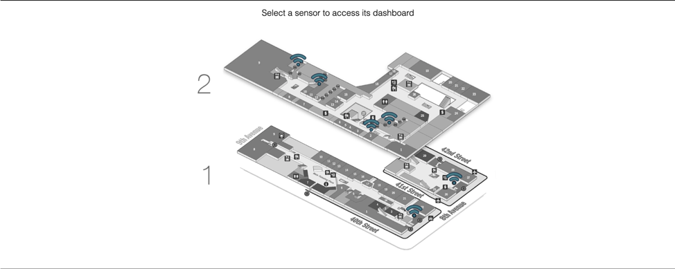

# Cooper-IoT
Internet Of Things(IoT) system acquire population data and environment parameters for The Cooper Union for the Advancement of Science and Art

Related 3D Telepresence Project, VR TELE, could be found at [here](https://github.com/ZhekaiJin/VR-TELE).

## Demo

* WIFI tracking in acion (click on the image to view the full video)*

## Related Publications
	
Shlayan, Neveen, Abdullah Kurkcu, and Kaan Ozbay. **"Exploring pedestrian Bluetooth and WiFi detection at public transportation terminals."** *IEEE 19th International Conference on Intelligent Transportation Systems (ITSC), 2016.* [pdf](https://ieeexplore.ieee.org/document/7795559) - [Info](http://www.utrc2.org/research/projects/real-time-estimation-transit-origin)

Ozbay, Kaan, Neveen Shlayan, and Hani Nassif. **“Real-Time Estimation of Transit OD Patterns and Delays Using Low Cost-Ubiquitous Advanced Technologies.”** *Transport Research International Documentation（TRID), 2017.* [pdf](trid.trb.org/view/1468647) - [info](http://www.utrc2.org/research/projects/real-time-estimation-transit-origin)

## Project Description
This project involves tracking the population in regards of number of occupants in a building as well as the population flow. The goal is to locate and pinpoint occupants’ position and the test is firstly conducted in 41 Cooper Square and will be extended to train station as a larger application.

***
  :point_right:This has been done by collecting data about WiFi MAC Addresses, Bluetooth addresses, video and picture captured by attached cameras. The information about humidity, temperature, and ambient lighting level is also collected for data visualization as well as later application of energy saving. Through the sensor system, back-end processing and front-end visualization, this project demonstrated a fully functionable and a complete Internet-of-Things system.
 
***A more advanced version has been built, but reserved for proprietary rights.***
More info could be found at publication:
* [Exploring pedestrian Bluetooth and WiFi detection at public transportation terminals](https://ieeexplore.ieee.org/document/7795559)
* [Real-time Estimation of Transit Origin-Destination Patterns and Delays Using Low-Cost Ubiquitous Advanced Technologies](http://www.utrc2.org/research/projects/real-time-estimation-transit-origin)
* [Final report](http://www.utrc2.org/publications/real-time-estimation-transit-od-patterns)

## Acknowledgments
* Thanks for the mentorship and support from our principal investigator **Dr. Neveen Shlayan**.

## Versioning
This work use [SemVer](http://semver.org/) for versioning. This repo now contains version 1.0.

## Authors
**[Zhekai Jin](https://zhekaijin.github.io/)**, Jialun Bao, [Rafi Mueen](https://www.linkedin.com/in/rafi-mueen/).

## Affiliated Lab
[Sustainable, Mobile, & Agile Connected Communities Lab](https://engfac.cooper.edu/nshlayan/689)
